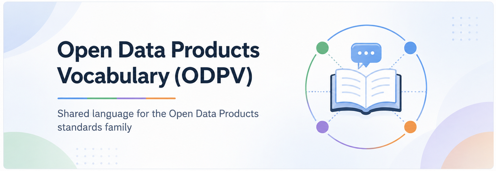

# Open Data Products Vocabulary (ODPV)

The Open Data Products Vocabulary, ODPV, is a vendor-neutral, open-source, machine-readable controlled vocabulary for data product management. ODPV defines shared terms used across the OpenDataProducts.org standards family, including data products, catalogs, graphs, value concepts, governance concepts, and relationship terms. It is designed to help organizations use consistent language across specifications, catalogs, graph implementations, AI assistants, and GraphRAG-ready data product portfolios.

# What ODPV Defines

ODPV defines the shared vocabulary layer for the OpenDataProducts.org standards family. The current vocabulary contains 78 terms across four concept groups:

| Section | Purpose | Terms |
|---|---|---:|
| ODPV Core | Foundational objects, roles, classifications, and references used across data products, catalogs, graphs, and agent workflows | 18 |
| ODPV Value | Demand, objectives, KPIs, strategy, outcomes, opportunities, risks, and portfolio prioritization | 17 |
| ODPV Governance | Quality, access, licensing, pricing, support, agreements, policies, compliance, and stewardship | 19 |
| ODPV Relationships | Reusable relationship terms for graph implementation, portfolio analysis, and cross-spec linking | 24 |

These groups create a common language for describing, connecting, validating, and reasoning over data product portfolios.

# Vocabulary Files

The canonical vocabulary source is [`source/vocab/odpv.yaml`](source/vocab/odpv.yaml). Derived files are generated from that source for tools, AI agents, catalogs, search, and graph workflows:

| Resource | Purpose |
|---|---|
| [`source/vocab/odpv.yaml`](source/vocab/odpv.yaml) | Canonical machine-readable vocabulary |
| [`source/vocab/odpv.json`](source/vocab/odpv.json) | JSON representation for tools and APIs |
| [`source/vocab/terms.jsonl`](source/vocab/terms.jsonl) | Agent-friendly one-term-per-line vocabulary for retrieval and embeddings |
| [`source/vocab/core.yaml`](source/vocab/core.yaml) | Core terms only |
| [`source/vocab/value.yaml`](source/vocab/value.yaml) | Value terms only |
| [`source/vocab/governance.yaml`](source/vocab/governance.yaml) | Governance terms only |
| [`source/vocab/relationships.yaml`](source/vocab/relationships.yaml) | Relationship terms only |
| [`source/llms.txt`](source/llms.txt) | AI agent guidance for using ODPV resources |

# Toolkit and AI Agents

The primary implementation toolkit for the Open Data Product standards family is the [Open Data Product Agent SDK](https://github.com/Open-Data-Product-Initiative/odp-agent-sdk). Use it when building tools, validators, catalog integrations, graph workflows, or AI agent workflows that need to work across ODPS, ODPC, ODPG, and ODPV.

This repository also includes helper scripts for maintaining and using the vocabulary:

| Script | Purpose |
|---|---|
| [`scripts/search_vocab.py`](scripts/search_vocab.py) | Search ODPV terms by label, alias, definition, example, and related term |
| [`scripts/validate_vocab.py`](scripts/validate_vocab.py) | Validate the canonical vocabulary and generated artifacts |
| [`scripts/generate_vocab_artifacts.py`](scripts/generate_vocab_artifacts.py) | Regenerate JSON, JSONL, and section YAML files from `odpv.yaml` |
| [`scripts/check_cross_spec_drift.py`](scripts/check_cross_spec_drift.py) | Compare published ODPS, ODPC, and ODPG schema terms against ODPV |

# Companion Vocabulary, Not a Heavy Ontology

ODPV is not intended to be a heavy ontology.

It is a practical controlled vocabulary that gives stable reference terms to the OpenDataProducts.org standards family. Each specification can reference ODPV terms instead of redefining shared concepts locally. Shared terms belong in ODPV. Spec-specific terms stay in the relevant specification. Extensions can define additional domain-specific or organization-specific terms.

# Relationship to ODPS, ODPC, and ODPG

* ODPS defines one data product.
* ODPC defines reusable catalog and portfolio objects.
* ODPG defines relationships between data products, use cases, objectives, KPIs, signals, and other portfolio objects.
* ODPV defines the shared language used by all of them.

Used together, ODPS, ODPC, ODPG, and ODPV create a machine-readable operating model for data product management.

# Why ODPV Matters

ODPV helps prevent terminology drift across the standards family. Without a shared vocabulary, each specification may define terms such as Data Product, Use Case, Objective, KPI, Signal, Owner, SLA, License, or Relationship slightly differently. ODPV gives these terms one stable reference point. This improves:

* Specification alignment
* Graph implementation
* Metadata validation
* Catalog interoperability
* AI-assisted discovery
* GraphRAG context
* Portfolio analysis
* Tool development

# Automated Drift Detection

ODPV includes automated cross-spec drift detection for the Open Data Product standards family. A weekly GitHub Action fetches the published ODPS, ODPC, and ODPG schemas, compares their schema terms against the canonical ODPV vocabulary, and writes a dated report.

Reports are kept in [`cross-spec-drift/`](cross-spec-drift/) so the project can track how alignment changes over time and use the historical reports as input for later analysis.

# Example Use

* A data product in ODPS can reference ODPV terms for concepts such as DataProduct, ProductDetails, ProductStrategy, DataHolder, SLA, DataQuality, License, DataAccess, PricingPlan, PaymentGateway, and Support.
* A catalog in ODPC can reference ODPV terms for concepts such as DataProductCatalog, UseCase, BusinessObjective, KPI, Signal, Gap, Priority, Reference, and Owner.
* A graph in ODPG can reference ODPV terms for node types and relationship types such as Agent, Workflow, Capability, uses, supports, contributesTo, measures, dependsOn, produces, consumes, ownedBy, alignsWith, impacts, exposes, and identifies.

# Specification Aims

* Define shared terms for data product management.
* Reduce duplicate term definitions across ODPS, ODPC, and ODPG.
* Prevent terminology drift across the standards family.
* Support consistent graph node and relationship naming.
* Support AI-assisted discovery, metadata generation, and GraphRAG.
* Improve interoperability between catalogs, platforms, marketplaces, and tools.
* Provide a lightweight path toward semantic knowledge graph implementation.
* Keep formal ontology work optional.

# Found a Bug?

Found a bug, question, or improvement idea?

Submit an issue or propose changes with a pull request.

# Contributors

Open Data Product Vocabulary is part of the OpenDataProducts.org standards family under the Open Data Product Initiative.

The project is developed as part of the broader work to expand OpenDataProducts.org from one specification into a modular family of standards for data product management.
