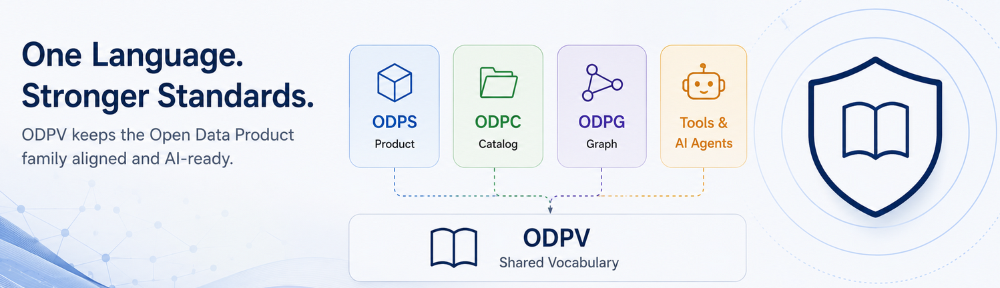

# ODPV Cross-Spec Drift Report

This report compares published Open Data Product family schemas against the canonical ODPV vocabulary.

Last drift detection run: `2026-05-23T12:12:21Z`

- ODPG schema: `https://opendataproducts.org/odpg-v1.0/schema/odpg.yaml`
- ODPC schema: `https://opendataproducts.org/odpc-v1.0/schema/odpc.yaml`
- ODPS schema: `https://opendataproducts.org/v4.1/schema/odps.yaml`
- ODPV source: `source/vocab/odpv.yaml`
- Checked terms: 49
- Possible drifts: 0

No unresolved drift detected.

## Possible Drift Summary

No unresolved drift detected.

## ODPG to ODPV

- Checked terms: 29
- Possible drifts: 0

No unresolved drift detected.

| ODPG source | ODPG term | ODPV match | Status | Notes |
|---|---|---|---|---|
| Node type | `DataProduct` | `DataProduct` | Exact match | ODPG term is an official ODPV id. |
| Node type | `UseCase` | `UseCase` | Exact match | ODPG term is an official ODPV id. |
| Node type | `BusinessObjective` | `BusinessObjective` | Exact match | ODPG term is an official ODPV id. |
| Node type | `KPI` | `KPI` | Exact match | ODPG term is an official ODPV id. |
| Node type | `Domain` | `Domain` | Exact match | ODPG term is an official ODPV id. |
| Node type | `Dataset` | `Dataset` | Exact match | ODPG term is an official ODPV id. |
| Node type | `API` | `DataService` | Alias match | ODPG term maps through ODPV alias. |
| Node type | `Policy` | `Policy` | Exact match | ODPG term is an official ODPV id. |
| Node type | `Workflow` | `Workflow` | Exact match | ODPG term is an official ODPV id. |
| Node type | `Agent` | `Agent` | Exact match | ODPG term is an official ODPV id. |
| Node type | `Capability` | `Capability` | Exact match | ODPG term is an official ODPV id. |
| Node type | `StrategicOpportunity` | `StrategicOpportunity` | Exact match | ODPG term is an official ODPV id. |
| Edge type | `uses` | `uses` | Exact match | ODPG term is an official ODPV id. |
| Edge type | `supports` | `supports` | Exact match | ODPG term is an official ODPV id. |
| Edge type | `contributesTo` | `contributesTo` | Exact match | ODPG term is an official ODPV id. |
| Edge type | `measures` | `measures` | Exact match | ODPG term is an official ODPV id. |
| Edge type | `tracks` | `measures` | Alias match | ODPG term maps through ODPV alias. |
| Edge type | `dependsOn` | `dependsOn` | Exact match | ODPG term is an official ODPV id. |
| Edge type | `produces` | `produces` | Exact match | ODPG term is an official ODPV id. |
| Edge type | `consumes` | `consumes` | Exact match | ODPG term is an official ODPV id. |
| Edge type | `governedBy` | `governedBy` | Exact match | ODPG term is an official ODPV id. |
| Edge type | `ownedBy` | `ownedBy` | Exact match | ODPG term is an official ODPV id. |
| Edge type | `alignsWith` | `alignsWith` | Exact match | ODPG term is an official ODPV id. |
| Edge type | `relatedTo` | `relatedTo` | Exact match | ODPG term is an official ODPV id. |
| Edge type | `impacts` | `impacts` | Exact match | ODPG term is an official ODPV id. |
| Edge type | `derivedFrom` | `derivedFrom` | Exact match | ODPG term is an official ODPV id. |
| Edge type | `exposes` | `exposes` | Exact match | ODPG term is an official ODPV id. |
| Edge type | `monitors` | `measures` | Alias match | ODPG term maps through ODPV alias. |
| Edge type | `identifies` | `identifies` | Exact match | ODPG term is an official ODPV id. |

## ODPC to ODPV

- Checked terms: 9
- Possible drifts: 0

No unresolved drift detected.

| ODPC source | ODPC term | ODPV match | Status | Notes |
|---|---|---|---|---|
| Schema definition | `Owner` | `Owner` | Exact match | ODPC term is an official ODPV id. |
| Schema definition | `GraphReference` | `Reference` | Alias match | ODPC term maps through ODPV alias. |
| Schema definition | `ProductModel` | `Reference` | Alias match | ODPC term maps through ODPV alias. |
| Schema definition | `ProductReference` | `Reference` | Alias match | ODPC term maps through ODPV alias. |
| Schema definition | `UseCase` | `UseCase` | Exact match | ODPC term is an official ODPV id. |
| Schema definition | `KPI` | `KPI` | Exact match | ODPC term is an official ODPV id. |
| Schema definition | `BusinessObjective` | `BusinessObjective` | Exact match | ODPC term is an official ODPV id. |
| Schema definition | `Signal` | `Signal` | Exact match | ODPC term is an official ODPV id. |
| Schema definition | `Catalog` | `DataProductCatalog` | Alias match | ODPC term maps through ODPV alias. |

## ODPS to ODPV

- Checked terms: 11
- Possible drifts: 0

No unresolved drift detected.

| ODPS source | ODPS term | ODPV match | Status | Notes |
|---|---|---|---|---|
| Product component | `contract` | `DataContract` | Alias match | ODPS term maps through ODPV alias. |
| Product component | `details` | `ProductDetails` | Alias match | ODPS term maps through ODPV alias. |
| Product component | `productStrategy` | `ProductStrategy` | Alias match | ODPS term maps through ODPV alias. |
| Product component | `pricingPlans` | `PricingPlan` | Alias match | ODPS term maps through ODPV alias. |
| Product component | `SLA` | `SLA` | Exact match | ODPS term is an official ODPV id. |
| Product component | `dataQuality` | `DataQuality` | Alias match | ODPS term maps through ODPV alias. |
| Product component | `dataAccess` | `DataAccess` | Alias match | ODPS term maps through ODPV alias. |
| Product component | `paymentGateways` | `PaymentGateway` | Alias match | ODPS term maps through ODPV alias. |
| Product component | `support` | `Support` | Alias match | ODPS term maps through ODPV alias. |
| Product component | `license` | `License` | Alias match | ODPS term maps through ODPV alias. |
| Product component | `dataHolder` | `DataHolder` | Alias match | ODPS term maps through ODPV alias. |
